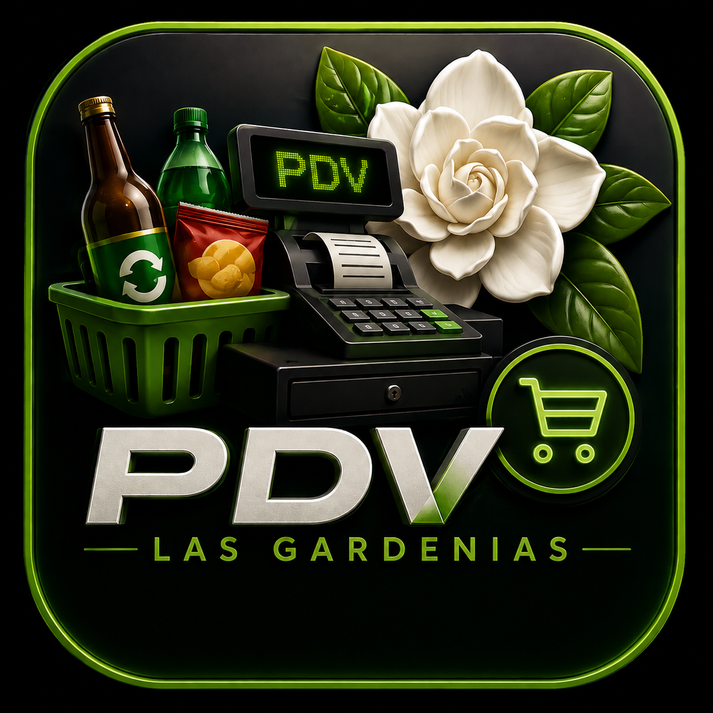
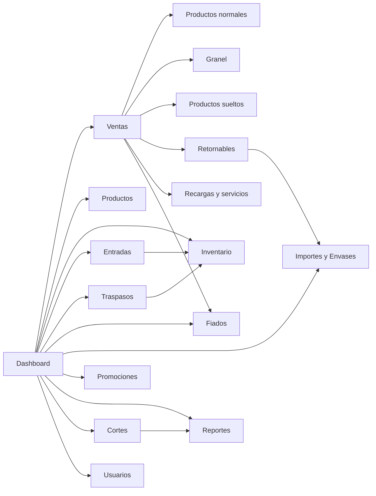

# PDV Las Gardenias



Sistema de punto de venta multitienda para operacion local, ventas rapidas, inventario, traspasos, fiados, envases retornables, recargas, servicios, cortes y reportes.

PDV Las Gardenias nacio para una tienda real: mostrador, clientes, envases, fiados, promociones, productos sueltos, recargas, entradas de mercancia, traspasos entre sucursales y decisiones diarias que no pueden depender de internet.

## Estado Actual

Version: `1.2.3`

Esta version consolida el sistema como una aplicacion de escritorio local, con migraciones automaticas, interfaz pulida y modulos operativos listos para pruebas reales antes de avanzar a sincronizacion entre tiendas.

## Lo Nuevo En 1.2.3

- Recargas electronicas con montos rapidos: `$10`, `$15`, `$20`, `$25`, `$30`, `$50`, `$100`, `$200` y `$500`.
- Servicios electronicos con monto libre para pagos como Sky, Google Play u otros servicios externos.
- Pago mixto con desglose real entre efectivo, transferencia y fiado.
- Registro de pagos mixtos en base de datos para cortes y reportes.
- Reportes y cortes ajustados para separar correctamente efectivo, transferencia y fiado.
- Redondeo operativo visible en ventas para productos a granel.
- Fechas locales corregidas para evitar adelantos por UTC.
- Envases prestados separados de deuda monetaria en fiados.
- Importes por caja de envase para cerveza, ademas del importe individual.
- Ajuste manual de envases con historial.
- Buscadores/autocomplete mejorados en traspasos, entradas, ajustes y promociones.
- Clientes fiados editables y desactivables con baja logica.
- Notificaciones de traspasos y alertas operativas desde dashboard.
- Login, dashboard e interfaz general mas cuidada visualmente.
- Logo propio de la aplicacion e icono de instalador para Windows.
- Migraciones automaticas reforzadas para tablas y columnas nuevas.

## Vision

El objetivo es que una tienda pueda operar sin hojas sueltas, sin calculos a mano y sin depender de servicios externos para funcionar.

El sistema esta pensado para:

- Vender rapido en mostrador.
- Controlar inventario por tienda.
- Evitar errores con productos sueltos o derivados.
- Controlar fiados sin confundir dinero con envases fisicos.
- Registrar traspasos entre sucursales.
- Ver reportes locales con graficas sin depender de CDN.
- Prepararse para sincronizacion futura entre tiendas.

## Mapa Operativo



## Modulos Principales

### Dashboard

Centro de acceso a toda la operacion. Muestra la sesion activa, accesos por rol, notificaciones de traspasos y alertas operativas. Los empleados no ven herramientas administrativas que no les corresponden.

### Ventas

Pantalla de venta rapida para codigo de barras, productos a granel, productos sueltos, retornables, recargas y servicios.

Incluye:

- Escaneo o escritura de codigo de barras.
- Agregar producto por peso.
- Agregar producto suelto o derivado.
- Agregar recarga o servicio electronico.
- Promociones por cantidad.
- Redondeo operativo a multiplos de `$0.50` para granel.
- Pago en efectivo, transferencia, fiado o mixto.
- Modal de pago mixto con desglose validado.
- Manejo de envases retornables.
- Recordatorio visual cuando se debe cobrar importe de envase.
- Validacion de stock antes de cobrar.
- Bloqueo contra doble cobro accidental.

### Recargas Y Servicios

Modulo integrado dentro de ventas para conceptos electronicos que no son inventario fisico.

Recargas:

- Montos rapidos.
- Comision automatica de `$1.00`.
- No requieren codigo de barras.
- No afectan inventario.

Servicios:

- Monto libre.
- Sin comision automatica.
- Sirven para pagos donde la comision puede variar.
- No afectan inventario.

### Productos

Administracion de catalogo.

Soporta:

- Productos con codigo de barras.
- Productos a granel.
- Productos manuales.
- Productos retornables ligados a tipos de envase.
- Productos derivados, como cigarros sueltos desde una cajetilla.
- Activacion y desactivacion.
- Busqueda por nombre, codigo, categoria, marca o presentacion.

### Inventario

Control de existencias por tienda.

El sistema evita mostrar decimales peligrosos en productos derivados. Por ejemplo, una cajetilla con cigarros sueltos se entiende como paquetes y piezas, no como `0.65 cajetillas`.

Ejemplo:

```text
1 cajetilla + 5 piezas
0 cajetillas + 7 piezas
```

### Entradas De Mercancia

Registro de mercancia nueva.

Permite buscar productos con autocomplete y capturar existencias de forma operativa. Para productos derivados, se pueden registrar paquetes cerrados y piezas sueltas.

### Ajustes De Inventario

Correcciones manuales por conteo fisico, merma, producto roto o diferencia de inventario.

Incluye buscador mejorado y soporte para productos derivados usando paquetes y piezas.

### Traspasos

Movimiento de mercancia entre tiendas.

Flujo:

1. Un administrador crea el traspaso.
2. El inventario baja en la tienda origen.
3. La tienda destino recibe notificacion.
4. El responsable revisa el detalle.
5. Al confirmar recepcion, el inventario sube en destino.

Incluye detalle de productos, notificacion en dashboard, recepcion por empleados o administradores y acceso controlado por rol.

### Fiados

Control de clientes, deudas y abonos.

Incluye:

- Crear clientes.
- Editar clientes.
- Desactivar clientes sin borrar historial.
- Registrar deuda monetaria.
- Registrar abonos.
- Ver historial.
- Controlar limite de credito.
- Integracion con ventas fiadas.
- Separacion entre dinero fiado y envases fisicos pendientes.

### Importes Y Envases Retornables

Modulo para manejar envases vacios, importes y prestamos de envase.

Escenarios:

- El cliente trae envase.
- El cliente deja importe.
- El cliente se lleva envase prestado.

Tambien incluye:

- Inventario de envases vacios.
- Ajuste manual de envases con historial.
- Importe por caja para envases de cerveza.
- Relacion con clientes fiados cuando aplica.
- Recepcion parcial o total de pendientes.

### Promociones

Promociones por cantidad sobre productos.

Ejemplo:

```text
2 piezas por $40.00
3 piezas por $25.00
```

El sistema conserva precio original, precio final, descuento aplicado y cantidad promocionada para historial y reportes.

### Cortes

Control de caja.

Considera:

- Ventas en efectivo.
- Transferencias.
- Fiados.
- Pagos mixtos separados por metodo.
- Movimientos manuales de caja.
- Devoluciones.

### Reportes

Panel de analisis con graficas locales.

Incluye:

- Ventas totales.
- Ventas registradas.
- Ticket promedio.
- Devoluciones.
- Ventas por dia.
- Metodos de pago.
- Productos mas vendidos.
- Promociones usadas.
- Inventario bajo.
- Fiados pendientes.

Las fechas se calculan con fecha local de la PC para evitar errores por UTC.

### Usuarios Y Roles

Administradores y empleados tienen accesos distintos.

Un administrador puede gestionar configuracion, usuarios, reportes, promociones y traspasos. Un empleado puede operar ventas y recibir traspasos cuando corresponda.

## Arquitectura

```text
PDV-Multitienda
|
|-- frontend/              Pantallas HTML, CSS y JavaScript
|   |-- js/                Logica de interfaz por modulo
|   |-- css/               Tailwind local y estilos compilados
|   |-- assets/            Imagenes usadas por el frontend
|
|-- backend/
|   |-- src/
|   |   |-- app.js          Servidor Express
|   |   |-- controllers/    Logica de negocio
|   |   |-- routes/         Rutas API
|   |   |-- database/       Conexion, migraciones y utilidades SQLite
|   |   |-- middlewares/    Autenticacion y roles
|   |   |-- utils/          Backups y utilidades
|
|-- assets/                Iconos de la app Electron
|-- main.js                Entrada Electron
|-- preload.js             Puente seguro Electron
|-- package.json           Scripts, build y configuracion
```

## Stack Tecnico

- JavaScript
- Node.js
- Express
- SQLite
- Electron
- Tailwind CSS local
- HTML y JavaScript vanilla
- JWT para autenticacion
- bcrypt para contrasenas
- electron-builder
- electron-updater

## Base De Datos

La aplicacion usa SQLite local. En Windows, la base operativa se guarda en:

```text
C:\Users\<usuario>\AppData\Roaming\LasGardenias\data\pdv.sqlite
```

El sistema ejecuta migraciones al iniciar para preparar tablas y columnas necesarias. Esto permite que una actualizacion cree automaticamente estructuras nuevas sin borrar la informacion existente.

Migraciones relevantes:

- Fiados y clientes.
- Accesos por usuario.
- Productos derivados.
- Productos retornables.
- Promociones.
- Traspasos.
- Ajustes de envases.
- Importes por caja.
- Pagos mixtos.
- Servicios electronicos.

## Rutas API

```text
/api/auth
/api/productos
/api/ventas
/api/inventario
/api/precios
/api/cortes
/api/entradas
/api/movimientos-caja
/api/ajustes-inventario
/api/devoluciones
/api/backups
/api/usuarios
/api/importes
/api/fiados
/api/promociones
/api/traspasos
/api/reportes
```

## Instalacion De Desarrollo

Instalar dependencias principales:

```powershell
npm install
```

Instalar dependencias del backend:

```powershell
cd backend
npm install
```

Iniciar backend en desarrollo:

```powershell
cd backend
npm run dev
```

Abrir Electron:

```powershell
npm run electron
```

Compilar CSS local:

```powershell
npm run build:css
```

Construir instalador:

```powershell
npm run build
```

## Flujo Operativo Recomendado

1. Configurar tienda y terminal.
2. Crear usuarios.
3. Registrar productos y tipos de envase.
4. Cargar inventario inicial con entradas o ajustes.
5. Operar ventas diarias.
6. Registrar devoluciones, fiados, importes o envases cuando aplique.
7. Usar traspasos para mover mercancia entre sucursales.
8. Revisar cortes y reportes.
9. Respaldar antes de publicar actualizaciones importantes.

## Principios Del Proyecto

- Offline primero.
- Rapido en mostrador.
- Sin dependencias visuales por internet.
- Base local con SQLite.
- Validaciones fuertes en backend.
- Interfaz clara para personal no tecnico.
- Separar dinero, inventario y envases fisicos.
- Pensado para operar antes que impresionar.

## Roadmap

Siguientes pasos naturales:

- Usar la version actual en tienda durante varias semanas.
- Corregir bugs reales detectados en operacion.
- Preparar sincronizacion entre tiendas.
- Resolver conflictos de inventario entre sucursales.
- Agregar auditoria avanzada para cambios sensibles.
- Exportar reportes.
- Automatizar pruebas de flujos criticos.

## Filosofia

Este PDV esta hecho para una tienda real, con problemas reales:

- Clientes que dejan importe.
- Envases que regresan despues.
- Cigarros que se venden sueltos.
- Mercancia que se mueve entre tiendas.
- Empleados que necesitan operar sin ver todo.
- Administradores que necesitan saber que esta pasando.
- Recargas y servicios que se cobran sin tocar inventario.

No es solo una caja registradora. Es el centro de control de Las Gardenias.
